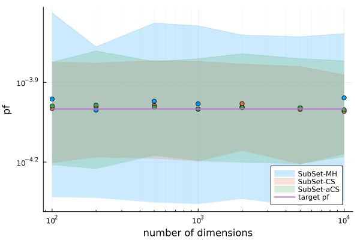

# High dimensional Subset simulation

## Subset simulation

The implemented subset simulation algorithms [`SubSetSimulation`](@ref) (using Metropolis-Hastings MCMC), [`SubSetInfinity`](@ref) (conditional sampling MCMC) and [`SubSetInfinityAdaptive`](@ref) (adaptive conditional sampling MCMC), work efficiently in high dimensions. This benchmark shows how these algorithms scale with increasing number of dimension `N` and increasingly smaller target probability of failure `pf_target`.

## Example function

In this example, the test model will be sum of independent standard normal distributions

```math
f_N(X) = \sum^N_i X_i,
```

where ``X_i \sim \Phi(0, 1)`` are standard normal random variables. We will define a linear limitstate

```math
g_N(X) = C_N - f_N(X),
```

where ``C_N`` will be defined such that the failure probability ``\mathbb{P}(g(X) \leq 0)`` matches a pre-defined value `pf_target`.

We can find ``C_N`` analytically, depending on the chosen number of dimensions and target probability of failure

```math
C_N = F_{\Phi_{\sqrt{N}}}^{-1}(1 - p_{\text{target}}),
```

where ``F_{\Phi_{\sqrt{N}}}^{-1}`` is the quantile function of a Gaussian distribution, with zero mean and standard deviation `sqrt(N)`.

Since the dimension and failure probability are two parameters of this numerical experiment, we can dynamically create the required number of random variables using broadcasting

```julia
using UncertaintyQuantification

N = 2000

inputs = RandomVariable.(Normal(), [Symbol("x$i") for i in 1:N])

```

The model can be defined generalized for arbitrary dimensions by summing the columns of the `DataFrame`. Using `names(inputs)` to select the columns we can safely exclude any extra variables that might be present.

```julia
f = Model(
    df -> sum(eachcol(df[:, names(inputs)])),
    :f
)
```

Next, the `pf_target` and corresponding limit state are defined.

```julia
pf_target = 1e-9

fail_limit = quantile(Normal(0, sqrt(N)), 1 - pf_target)

function g(df)
    return fail_limit .- df.f
end
```

For this benchmark, the probability of failure will be estimated using all available variants of Subset simulation

```julia
subset_MH = SubSetSimulation(2000, 0.1, 20, Uniform(-0.5, 0.5))
subset_CS = SubSetInfinity(2000, 0.1, 20, 0.5)
subset_aCS = SubSetInfinityAdaptive(2000, 0.1, 20, 200)
```

!!! note "Monte Carlo simulation"
    Although standard Monte Carlo simulation works independently of dimension, for a target failure probability of ``10^{-9}``, even with a billion ``10^9`` samples it can return ``p_f=0``.

As a first benchmark the three subset simulation algorithms are used to solve the example problem with a fixed number of dimensions `N=200` and sample size per level `N_samples=2000` for increasingly smaller target probability of failures. The following figure shows the average estimated probabilities of failure and the standard deviation resulting from 100 independent simulation runs. Note how the variance of the estimation increases for smaller `pf` values. However, in comparison, the variance of the Metropolis-Hastings variant is higher than the variance of the conditional sampling methods.


For the next benchmark, the number of dimensions remains fixed at 200 while the  number of samples is increased to estimate a target probability of failure of ``10^{-4}``.


The final benchmark uses the same fixed target ``p_{f} = 10^{-4}`` and again keeps the number of samples constant at `2000` per level. This time, the number of dimensions is increased to raise the complexity of the problem.


