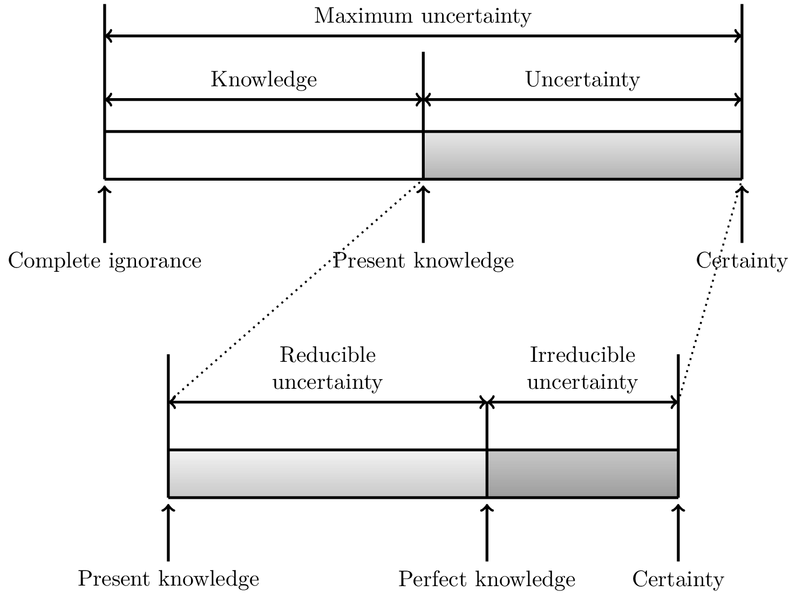

# Introduction

## Uncertainty

The definition of *uncertainty* follows from the absence of *certainty* describing a state of absolute knowledge where everything there is to know about a process is known [nikolaidisTypesUncertaintyDesign2004](@cite). This however is a theoretical and unachievable state in which deterministic models would be sufficient for the analysis of engineering systems. In reality, there is always a gap between certainty and the current state of knowledge resulting in *uncertainty*.

|  |
| :--: |
| *Characterization of reducible and irreducible uncertainties. Adapted from [aughenbaughValueUsingImprecise2005](@cite)*. |

Although a topic of ongoing debate and revision [aughenbaughValueUsingImprecise2005](@cite), it is largely accepted that uncertainty can be broadly classified into two types, *aleatory* and *epistemic* uncertainty [kiureghianAleatoryEpistemicDoes2009](@cite). The first type, *aleatory* uncertainties, are also called *irreducible* uncertainties or *variability* and describe the inherent randomness of a process. This could, for example, be variability in material properties, degradation of components, or varying external forces such as wind loads or earthquakes. Some researchers debate the existence of aleatory uncertainty under the assumption that if a process was fully understood it would no longer be random. Epistemic uncertainty is the uncertainty resulting from a lack of knowledge or vagueness and is also called *reducible* uncertainty, as it can be reduced through the collection of additional data and information. If both types of uncertainties occur together this is sometimes called *hybrid* or *mixed* uncertainty, and can be modelled using imprecise probability.

We follow Bi et al. [biBhattacharyyaDistanceEnriching2019](@cite) in dividing uncertainties into four categories:
    - Category I: Constant parameters without any associated uncertainty,
    - Category II: Parameters only subject to epistemic uncertainty represented as intervals,
    - Category III: Variables with only aleatory uncertainties, fully described by probability distributions,
    - Category IV: Variables subject to both aleatory and epistemic uncertainty represented using imprecise probabilities, for example using probability boxes.

Next follows a brief introduction to the modelling of precise (category III) and imprecise probabilities (category IV).

A continuous random variable $X$ is uniquely defined by its cumulative density function (CDF) $F: \mathbb{R} \rightarrow [0,1]$. By definition, it returns the probability that the random variable will take a value less than or equal to $x$

```math
    F_X(x) = P_X(X \leq x).
```

A CDF is a right continuous and monotonically non-decreasing function which satisfies

```math
    \lim_{x\rightarrow -\infty} F_X(x) = 0
```

and

```math
    \lim_{x\rightarrow \infty}  F_X(x) = 1.
```

Consider a small interval of width $\Delta x$ on the real line $\mathbb{R}$. The probability that the value of a random variable $X$ falls in this interval is

```math
    P(x < X \leq (x + \Delta x)).
```

This probability varies with the magnitude of $\Delta x$, with a larger interval leading to a higher probability. Normalizing the probability as

```math
    \frac{1}{\Delta x}P(x < X \leq (x + \Delta x))
```

gives the *density* of the probability over the interval. The limit of this density when the interval approaches $0$ gives the so-called probability density function (PDF) of$X$. The PDF of a random variable can be obtained as the derivative of the CDF

```math
    f_X(x) = \frac{dF_X(x)}{dx}
```

if it exists. Conversely, the CDF can be defined as the integral of the PDF as

```math
    F_X(x) = \int_{-\infty}^x f_X(\lambda) d\lambda.
```

Using the PDF and CDF random variables subject to aleatory uncertainty can be described using well established probability theory.

Ferson et al. [fersonConstructingProbabilityBoxes2015](@cite) introduced the notion of a *probability box* (p-box) for the representing variables witg both epistemic and aleatory uncertainty. Consider two CDFs $\underline{F}$ and $\overline{F}$ with $\underline{F}(x) \leq \overline{F}(x)$ for all $x \in \mathbb{R} $. Then, $[\underline{F}(x), \overline{F}(x)]$ is the set of CDFs $F$ such that $\underline{F}(x) \leq F(x) \leq \overline{F}(x)$. This set is called the p-box for an imprecisely known random variable $X$, where $\underline{F}(x)$ is the lower bound for the probability that $X$ is smaller than or equal to $x$, and $\overline{F}(x)$ is the upper bound of this probability. The density is difficult to define for a p-box, 

The simplest way to construct a p-box is using a known parametric family (normal, exponential, ...) with intervals for their parameters (mean, variance, ...), and from this we can form the set $[\underline{F}(x), \overline{F}(x)]$. This is known as parametric p-box, only containing distributions following the specified distribution family. If no family information is available, but $[\underline{F}(x), \overline{F}(x)]$ are known, this is known as a _distribution-free_ p-box, where every possible CDF between the bounds is a valid random variable.

Special algorithms must be used to propagate the epistemic uncertainty through models. As a result, the analysis also returns upper and lower bounds. This propagation of the epistemic uncertainty comes with a significant increase in computational demand.

In *UncertaintyQuantification.jl* the four categories of uncertainties are described using the following objects:

- Category I: [`Parameter`](@ref)
- Category II: [`Interval`](@ref)
- Category III: [`RandomVariable`](@ref)
- Category IV: [`ProbabilityBox`](@ref).
