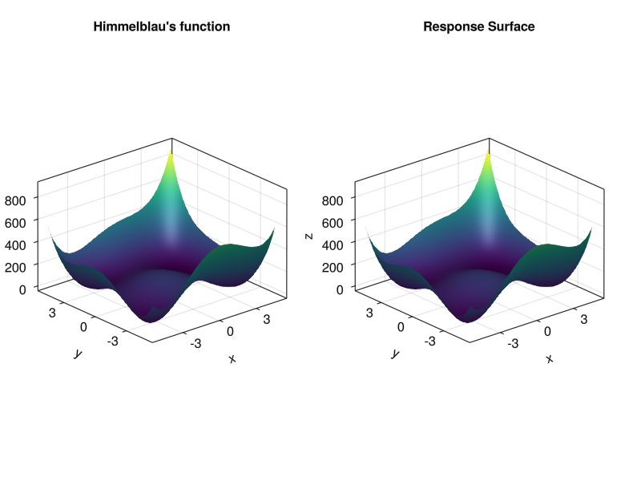

# Metamodels
## Design Of Experiments

Design Of Experiments (DOE) offers various designs that can be used for creating a model of a given system. The core idea is to evaluate significant points of the system in order to obtain a sufficient model while keeping the effort to achieve this relatively low.
Depending on the parameters, their individual importance and interconnections, different designs may be adequate.

The ones implemented here are `TwoLevelFactorial`, `FullFactorial`, `FractionalFactorial`, `CentralComposite` and `BoxBehnken`.

## Response Surface

A Response Surface is a structure used for modeling. 
It can be trained by providing it with evaluated points of a function.
It will then, using polynomial regression, compute a model of that function.

## Example

In this example, we will model the following test function (known as Himmelblau's function) $\newline$in the range $x1, x2 ∈ [-5, 5]$. It is defined as $\newline$

$f(x1, x2) = (x1^2 + x2 - 11)^2 + (x1 + x2^2 - 7)^2$.


At first we need to create an array of random variables, that will be used when evaluating the points that our desgin produces.
It will also define the range of the function we want the design to fit.
This is also a good time to declare the function that we are working with.

```@example subset
using UncertaintyQuantification #hide
x = RandomVariable.(Uniform(-5, 5), [:x1, :x2])

fun = Model(df -> (df.x1 .^2 .+ df.x2 .- 11) .^2 .+ (df.x1 .+ df.x2 .^2 .- 7) .^2,:y)

nothing # hide
```

Our next step is to chose the design we want to use and if required, set the parameters to the values we need or want.
In this example, we are using a `FullFactorial` design:

```@example subset
design = FullFactorial([5, 5])
nothing # hide
```
After that, we call the sample function with our design.
This produces a matrix containing the points of our design fitted to the range defined via the RandomVariables.
Wer then evaluate the function we want to model in these points and use the resulting data to train a `ResponseSurface`.
The `ResponseSurface` uses regression to fit a polynomial function to the given datapoints.
That functions degree is set as an Integer in the constructor.

> **_NOTE:_**  The choice of the degree and the design and its parameters may be crucial to obtaining a sufficient model.

```@example subset
training_data = sample(x, design)
evaluate!(fun, training_data)
rs = ResponseSurface(trainig_data, 4)
nothing #hide
```
To evaluate the `ResponseSurface`use `evaluate!(rs::ResponseSurface, data::DataFrame)` with the dataframe containing the points you want to evaluate.

The model in this case has an mse of about 1e-26 and looks like this in comparison to the original:




