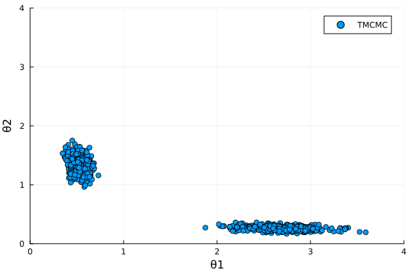
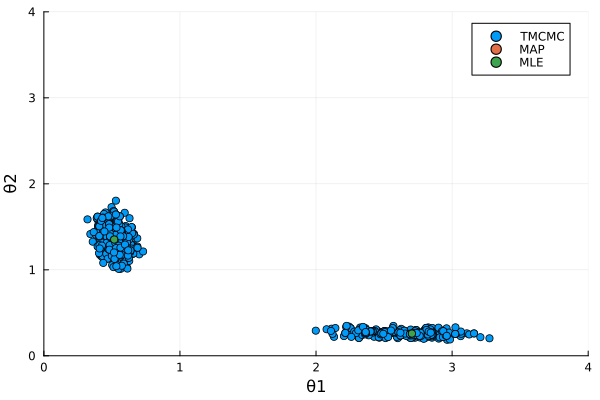
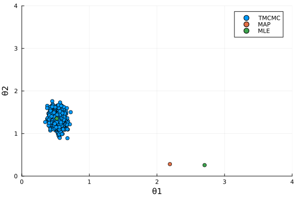

# Bayesian Updating {#Bayesian-Updating}

## Inverse eigenvalue problem {#Inverse-eigenvalue-problem}

The inverse eigenvalue problem is a classic engineering example. Here we will use Bayesian updating to sample from a bivariate posterior distribution describing unknown quantities of a matrix

$$\begin{bmatrix}
 \theta_1 + \theta_2 & -\theta_2 \\
 -\theta_2 & \theta_2 \\
\end{bmatrix}$$

A matrix of this form can represent different problems, like the stiffness matrix describing a tuned mass damper system. In this example we assume the fixed values $\theta_1 = 0.5$ and $\theta_2 = 1.5$ for the variables.

The eigenvalues $\lambda_1$ and $\lambda_2$ of this matrix represent a physical measurable property corrupted by &quot;noise&quot; created for example due to environmental factors or measurement inaccuracy.

$$\lambda_1^{noisy} = \frac{(\theta_1+2\theta_2)+\sqrt{\theta_1^2+4{\theta_2}^2}}{2} + \epsilon_1$$

$$\lambda_2^{noisy} = \frac{(\theta_1+2\theta_2)-\sqrt{\theta_1^2+4{\theta_2}^2}}{2} + \epsilon_2$$

The &quot;noise&quot; terms $\epsilon_1$ and $\epsilon_2$ follow a Normal distribution with zero mean and standard deviations $\sigma_1 = 1.0$ and $\sigma_2 = 0.1$.

The synthetic &quot;noisy&quot; data used for the Bayesian updating procedure is given in the following table.

| $\lambda_1$ | $\lambda_2$ |
| -----------:| -----------:|
|        1.51 |        0.33 |
|        4.01 |        0.30 |
|        3.16 |        0.17 |
|        3.21 |        0.18 |
|        2.19 |        0.32 |
|        1.71 |        0.23 |
|        2.73 |        0.21 |
|        5.51 |        0.20 |
|        1.95 |        0.11 |
|        4.48 |        0.20 |
|        1.43 |        0.16 |
|        2.91 |        0.26 |
|        3.91 |        0.23 |
|        3.58 |        0.25 |
|        2.62 |        0.25 |


The a priori knowledge of $\theta_1$ and $\theta_2$ is that they take values between 0.01 and 4. The likelihood function used for this problem is a bivariate Gaussian function with a covariance matrix $\begin{bmatrix} \sigma_1^2 & 0 \\ 0 & \sigma_2^2 \end{bmatrix}$, with off-diagonal terms equal to 0 and the diagonal terms corresponding to the variances of the respective noise terms.

$$P(\lambda|\theta) \propto \exp \left[-\frac{1}{2}\sum_{i=1}^2\sum_{n=1}^{15} {\left(\frac{\lambda_{i,n}^{data}-\lambda_i^{model}}{\sigma_i}\right)}^2\right]$$

To begin the Bayesian model updating procedure we start by defining the data, the models for the eigenvalues (without the noise term) and the likelihood function.

```julia
Y = [
    1.51 0.33
    4.01 0.3
    3.16 0.27
    3.21 0.18
    2.19 0.33
    1.71 0.23
    2.73 0.21
    5.51 0.2
    1.95 0.11
    4.48 0.2
    1.43 0.16
    2.91 0.26
    3.81 0.23
    3.58 0.25
    2.62 0.25
]

λ1 = @. Model(df -> ((df.θ1 + 2 * df.θ2) + sqrt(df.θ1^2 + 4 * df.θ2^2)) / 2, :λ1)
λ2 = @. Model(df -> ((df.θ1 + 2 * df.θ2) - sqrt(df.θ1^2 + 4 * df.θ2^2)) / 2, :λ2)

σ = [1.0 0.1]
function likelihood(df)
    λ = [df.λ1 df.λ2]

    return log.(exp.([-0.5 * sum(((Y .- λ[n, :]') ./ σ) .^ 2) for n in axes(λ, 1)]))
end
```


```ansi
likelihood (generic function with 1 method)
```


We will solve this problem using the TMCMC algorithm, as well as multi-objective maximum a priori (MAP) and maximum likelihood (ML) estimates. Therefore, the next step is to define the [`RandomVariable`](/api/inputs#UncertaintyQuantification.RandomVariable) vector of the prior, followed by the objects for the estimaters ([`TransitionalMarkovChainMonteCarlo`](/api/bayesianupdating#UncertaintyQuantification.TransitionalMarkovChainMonteCarlo)). We also have to choose number of samples and burn-in for TMCMC.

```julia
prior = RandomVariable.(Uniform(0.01, 4), [:θ1, :θ2])

n = 1000
burnin = 0

x0 = [[1., 1.],[3.,.5],[2.,2.]]

tmcmc = TransitionalMarkovChainMonteCarlo(prior, n, burnin)
```


```ansi
TransitionalMarkovChainMonteCarlo(RandomVariable{Uniform{Float64}}[RandomVariable{Uniform{Float64}}(Uniform{Float64}(a=0.01, b=4.0), :θ1), RandomVariable{Uniform{Float64}}(Uniform{Float64}(a=0.01, b=4.0), :θ2)], 1000, 0, 0.2, true)
```


With the prior, likelihood, models and  MCMC sampler defined, the last step is to call the [`bayesianupdating`](/api/bayesianupdating#UncertaintyQuantification.bayesianupdating) method.

```julia
samples, evidence = bayesianupdating(likelihood, [λ1, λ2], tmcmc)

scatter(samples.θ1, samples.θ2; lim=[0, 4], label="TMCMC", xlabel="θ1", ylabel="θ2")
```



  A scatter plot of the resulting samples shows convergence to two distinct regions. Unlike the transitional Markov Chain Monte Carlo algorithm, the standard Metropolis-Hastings algorithm would have only identified one of the two regions.

## Inverse eigenvalue problem with maximum likelihood and maximum a posteriori point estimation {#Inverse-eigenvalue-problem-with-maximum-likelihood-and-maximum-a-posteriori-point-estimation}

The inverse eigenvalue problem can also be solved with point estimation schemes, i.e. maximum likelihood estimate (MLE) and maximum a posteriori (MAP) estimate. Both find the maximum of either only the likelihood (MLE) or the posterior (MAP) using optimization. The main difference in both is that MLE does not use the prior information, it will only give an estimate of the most likely parameter values based on the measurements. MAP on the other hand takes into account the prior distribution and gives a weighted estimate of the most likely parameters. MAP thus can also be seen as regularization of MLE.

We will set up the problem the same way as in the MCMC example.

```julia
Y = [
    1.51 0.33
    4.01 0.3
    3.16 0.27
    3.21 0.18
    2.19 0.33
    1.71 0.23
    2.73 0.21
    5.51 0.2
    1.95 0.11
    4.48 0.2
    1.43 0.16
    2.91 0.26
    3.81 0.23
    3.58 0.25
    2.62 0.25
]

λ1 = @. Model(df -> ((df.θ1 + 2 * df.θ2) + sqrt(df.θ1^2 + 4 * df.θ2^2)) / 2, :λ1)
λ2 = @. Model(df -> ((df.θ1 + 2 * df.θ2) - sqrt(df.θ1^2 + 4 * df.θ2^2)) / 2, :λ2)

σ = [1.0 0.1]

function likelihood(df)
    λ = [df.λ1 df.λ2]

    return log.(exp.([-0.5 * sum(((Y .- λ[n, :]') ./ σ) .^ 2) for n in axes(λ, 1)]))
end
```


```ansi
likelihood (generic function with 1 method)
```


For MLE and MAP we need to define the prior, however note that in MLE the defined [`RandomVariable`](/api/inputs#UncertaintyQuantification.RandomVariable) is only used to inform the updating process of which paramters to update. The distribution will not affect the updating, as only the likelihood is taken into account. For the optimization we also need to define starting point(s). Since we know that the problem is multi-modal, we can define multiple starting points to find both modes. We also have to specify the optimization procedure, in this case we will use LBFGS. To illustrate the results of MAP and MLE, we will also solve the problem with TMCMC.

```julia
prior = RandomVariable.(Uniform(.1, 10), [:θ1, :θ2])

burnin = 0
n = 1000

x0 = [[1., 1.],[3.,.5]]

tmcmc = TransitionalMarkovChainMonteCarlo(prior, n, burnin)
MAP = MaximumAPosterioriBayesian(prior, "LBFGS", x0)
MLE = MaximumLikelihoodBayesian(prior, "LBFGS", x0)
```


```ansi
MaximumLikelihoodBayesian(RandomVariable{Uniform{Float64}}[RandomVariable{Uniform{Float64}}(Uniform{Float64}(a=0.1, b=10.0), :θ1), RandomVariable{Uniform{Float64}}(Uniform{Float64}(a=0.1, b=10.0), :θ2)], "LBFGS", [[1.0, 1.0], [3.0, 0.5]], true, [-Inf], [Inf])
```


With the prior, likelihood, models and  MCMC sampler defined, the last step is to call the [`bayesianupdating`](/api/bayesianupdating#UncertaintyQuantification.bayesianupdating) method.

```julia
samples, evidence = bayesianupdating(likelihood, [λ1, λ2], tmcmc)
MapEstimate = bayesianupdating(likelihood, [λ1, λ2], MAP)
MLEstimate = bayesianupdating(likelihood, [λ1, λ2], MLE)

scatter(samples.θ1, samples.θ2; lim=[0, 4], label="TMCMC", xlabel="θ1", ylabel="θ2")
scatter!((MapEstimate.θ1, MapEstimate.θ2), label="MAP")
scatter!((MLEstimate.θ1, MLEstimate.θ2), label="MLE")
```



  A scatter plot of the resulting samples shows convergence to two distinct regions. Since we used a uniform prior distribution, ML and MAP estimates find the same estimates. With a different prior distribution, i.e. a standard normal centered on one of the modes, we obtain a different result:

```julia
priorθ1 = RandomVariable(Normal(.5, .5), :θ1)
priorθ2 = RandomVariable(Normal(1.5, .5), :θ2)

prior = [priorθ1, priorθ2]

burnin = 0
n = 1000

x0 = [[1., 1.],[3.,.5]]

tmcmc = TransitionalMarkovChainMonteCarlo(prior, n, burnin)
MAP = MaximumAPosterioriBayesian(prior, "LBFGS", x0)
MLE = MaximumLikelihoodBayesian(prior, "LBFGS", x0)

samples, evidence = bayesianupdating(likelihood, [λ1, λ2], tmcmc)
MapEstimate = bayesianupdating(likelihood, [λ1, λ2], MAP)
MLEstimate = bayesianupdating(likelihood, [λ1, λ2], MLE)

scatter(samples.θ1, samples.θ2; lim=[0, 4], label="TMCMC", xlabel="θ1", ylabel="θ2")
scatter!((MapEstimate.θ1, MapEstimate.θ2), label="MAP")
scatter!((MLEstimate.θ1, MLEstimate.θ2), label="MLE")
```



 Some things to note: Results from MLE are the same as before, since the prior distribution is not taken into account. MCMC does not find the second mode, since it is much less likely than the first one, so the Markov chains do not converge there. MAP does find the mode since it uses optimization and therefore is able to find the local maximum. A look at the relative values between both modes show the differences in probability:

```julia
println(exp.(MLEstimate[!,:maxval]))
println(exp.(MapEstimate[!,:maxval]))
```


```ansi
[5.846036389174862e-6, 5.846036389174862e-6]
[3.5711506271809486e-6, 1.0072485673125022e-10]
```


The second mode is 4 orders of magnitude less probable than the first mode, which explains why the Markov chains do not converge there.


---


_This page was generated using [Literate.jl](https://github.com/fredrikekre/Literate.jl)._
