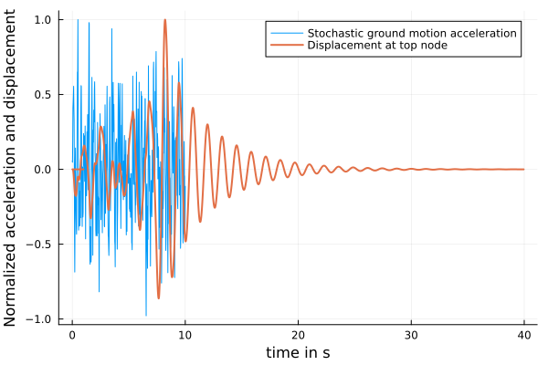

# Stochastic Dynamics Example {#Stochastic-Dynamics-Example}

## OpenSees earthquake signal on a cantilever column {#OpenSees-earthquake-signal-on-a-cantilever-column}

In this example we will perform the reliability analysis of a multi element cantilever column subjected to artificial stochastic ground motions using the open-source finite element software [OpenSees](https://opensees.berkeley.edu/). The example definition can be found [here](https://opensees.berkeley.edu/wiki/index.php?title=Time_History_Analysis_of_a_2D_Elastic_Cantilever_Column) A stochastic signal is generated using the Clough-Penzien Power Spectral Density and the Spectral Representation Method. The signal is applied as uniform excitation as &quot;ground motion&quot; to the base of the column structure.

For parallel execution, see the example in [OpenSees supported beam parallel](/examples/external#OpenSees-supported-beam-parallel)

Time discretization for the signal

```julia
Δt = Parameter(0.02, :dt)
t = collect(0:Δt.value:10)
timeSteps = Parameter(length(t), :timeSteps)
```


```ansi
Parameter(501, :timeSteps)
```


Frequency discretization for the Power Spectral Density Function (PSD)

```julia
ω = collect(0:0.6:150)
```


```ansi
251-element Vector{Float64}:
   0.0
   0.6
   1.2
   1.8
   2.4
   3.0
   3.6
   4.2
   4.8
   5.4
   ⋮
 145.2
 145.8
 146.4
 147.0
 147.6
 148.2
 148.8
 149.4
 150.0
```


Definition of Clough Penzien PSD with prescribed parameters

```julia
cp = CloughPenzien(ω, 0.1, 0.8π, 0.6, 8π, 0.6)
```


```ansi
CloughPenzien([0.0, 0.6, 1.2, 1.8, 2.4, 3.0, 3.6, 4.2, 4.8, 5.4  …  144.6, 145.2, 145.8, 146.4, 147.0, 147.6, 148.2, 148.8, 149.4, 150.0], 0.1, 2.5132741228718345, 0.6, 25.132741228718345, 0.6, [0.0, 0.00033479010678994165, 0.005648397880232318, 0.027238098552746347, 0.06410222525109868, 0.09353984901109647, 0.10792641434414753, 0.11381997701363389, 0.11642527143144965, 0.1180173689656726  …  0.004514428300183395, 0.00447586463650233, 0.0044377976043132854, 0.004400218647369274, 0.004363119393980723, 0.004326491652239116, 0.004290327405384585, 0.004254618807312541, 0.004219358178214532, 0.004184538000348823])
```


Ground motion formulation using the Spectral Representation Method

```julia
gm = SpectralRepresentation(cp, t, :gm)
gm_model = StochasticProcessModel(gm)
```


```ansi
StochasticProcessModel(SpectralRepresentation(CloughPenzien([0.0, 0.6, 1.2, 1.8, 2.4, 3.0, 3.6, 4.2, 4.8, 5.4  …  144.6, 145.2, 145.8, 146.4, 147.0, 147.6, 148.2, 148.8, 149.4, 150.0], 0.1, 2.5132741228718345, 0.6, 25.132741228718345, 0.6, [0.0, 0.00033479010678994165, 0.005648397880232318, 0.027238098552746347, 0.06410222525109868, 0.09353984901109647, 0.10792641434414753, 0.11381997701363389, 0.11642527143144965, 0.1180173689656726  …  0.004514428300183395, 0.00447586463650233, 0.0044377976043132854, 0.004400218647369274, 0.004363119393980723, 0.004326491652239116, 0.004290327405384585, 0.004254618807312541, 0.004219358178214532, 0.004184538000348823]), [0.0, 0.02, 0.04, 0.06, 0.08, 0.1, 0.12, 0.14, 0.16, 0.18  …  9.82, 9.84, 9.86, 9.88, 9.9, 9.92, 9.94, 9.96, 9.98, 10.0], [0.0 0.0 … 0.0 0.0; 0.0 0.012 … 5.988 6.0; … ; 0.0 2.988 … 1491.0120000000002 1494.0; 0.0 3.0 … 1497.0 1500.0], 0.6, [0.0, 0.020043655558503543, 0.08232908025891447, 0.18079191979537032, 0.27734936506384583, 0.33503405619924037, 0.3598773363425058, 0.3695726889481427, 0.3737784446938314, 0.3763254479287935  …  0.0736024045817803, 0.07328736292023882, 0.07297504453699184, 0.07266541389714318, 0.07235843608575898, 0.07205407679435591, 0.07175230230774134, 0.07145307949119513, 0.07115637577798238, 0.0708621591571876], :gm, [:gm_ϕ_1, :gm_ϕ_2, :gm_ϕ_3, :gm_ϕ_4, :gm_ϕ_5, :gm_ϕ_6, :gm_ϕ_7, :gm_ϕ_8, :gm_ϕ_9, :gm_ϕ_10  …  :gm_ϕ_242, :gm_ϕ_243, :gm_ϕ_244, :gm_ϕ_245, :gm_ϕ_246, :gm_ϕ_247, :gm_ϕ_248, :gm_ϕ_249, :gm_ϕ_250, :gm_ϕ_251]), :gm)
```


Source/Extra files are expected to be in this folder, here the injection file ground-motion.dat is located

```julia
sourcedir = joinpath(pwd(), "demo/models/opensees-dynamic-cantilever-column")
```


```ansi
"/home/runner/work/UncertaintyQuantification.jl/UncertaintyQuantification.jl/docs/build/examples/demo/models/opensees-dynamic-cantilever-column"
```


These files will be rendere through Mustach.jl and have values injected, for this example only ground-motion.dat will have time serieses injected

```julia
sourcefile = ["cantilever-column.tcl", "ground-motion.dat"]
```


```ansi
2-element Vector{String}:
 "cantilever-column.tcl"
 "ground-motion.dat"
```


Dictionary to map format Strings (Formatting.jl) to variables

```julia
numberformats = Dict(:dt => ".8e", :gm => ".8e")
```


```ansi
Dict{Symbol, String} with 2 entries:
  :dt => ".8e"
  :gm => ".8e"
```


UQ will create subfolders in here to run the solver and store the results

```julia
workdir = joinpath(pwd(), "workdir-cantilever-column")
```


```ansi
"/home/runner/work/UncertaintyQuantification.jl/UncertaintyQuantification.jl/docs/build/examples/workdir-cantilever-column"
```


Read output file and compute maximum (absolute) displacement An extractor is based the working directory for the current sample

```julia
max_abs_disp = Extractor(base -> begin
    file = joinpath(base, "displacement.out")
    data = DelimitedFiles.readdlm(file, ' ')

    return maximum(abs.(data[:, 2]))
end, :max_abs_disp)
```


```ansi
Extractor(Main.var"#1#2"(), :max_abs_disp)
```


Extractor for the full time series of the displacement at the top node

```julia
disp = Extractor(base -> begin
    file = joinpath(base, "displacement.out")
    data = DelimitedFiles.readdlm(file, ' ')

    return data[:, 2]
end, :disp)
```


```ansi
Extractor(Main.var"#3#4"(), :disp)
```


Extractor for the simulation time

```julia
sim_time = Extractor(base -> begin
    file = joinpath(base, "displacement.out")
    data = DelimitedFiles.readdlm(file, ' ')

    return data[:, 1]
end, :sim_time)


opensees = Solver(
    "OpenSees", # path to OpenSees binary
    "cantilever-column.tcl";
    args="", # (optional) extra arguments passed to the solver
)
```


```ansi
Solver("OpenSees", "cantilever-column.tcl", "")
```


Define the external model with all needed parameters and attributes

```julia
ext = ExternalModel(
    sourcedir, sourcefile, [max_abs_disp, disp, sim_time], opensees; workdir=workdir, formats=numberformats
)
```


```ansi
ExternalModel("/home/runner/work/UncertaintyQuantification.jl/UncertaintyQuantification.jl/docs/build/examples/demo/models/opensees-dynamic-cantilever-column", ["cantilever-column.tcl", "ground-motion.dat"], Extractor[Extractor(Main.var"#1#2"(), :max_abs_disp), Extractor(Main.var"#3#4"(), :disp), Extractor(Main.var"#5#6"(), :sim_time)], Solver("OpenSees", "cantilever-column.tcl", ""), "/home/runner/work/UncertaintyQuantification.jl/UncertaintyQuantification.jl/docs/build/examples/workdir-cantilever-column", String[], Dict(:dt => ".8e", :gm => ".8e"), false, nothing)
```


Define the UQ.jl models used in the analysis

```julia
models = [gm_model, ext]
```


```ansi
2-element Vector{UQModel}:
 StochasticProcessModel(SpectralRepresentation(CloughPenzien([0.0, 0.6, 1.2, 1.8, 2.4, 3.0, 3.6, 4.2, 4.8, 5.4  …  144.6, 145.2, 145.8, 146.4, 147.0, 147.6, 148.2, 148.8, 149.4, 150.0], 0.1, 2.5132741228718345, 0.6, 25.132741228718345, 0.6, [0.0, 0.00033479010678994165, 0.005648397880232318, 0.027238098552746347, 0.06410222525109868, 0.09353984901109647, 0.10792641434414753, 0.11381997701363389, 0.11642527143144965, 0.1180173689656726  …  0.004514428300183395, 0.00447586463650233, 0.0044377976043132854, 0.004400218647369274, 0.004363119393980723, 0.004326491652239116, 0.004290327405384585, 0.004254618807312541, 0.004219358178214532, 0.004184538000348823]), [0.0, 0.02, 0.04, 0.06, 0.08, 0.1, 0.12, 0.14, 0.16, 0.18  …  9.82, 9.84, 9.86, 9.88, 9.9, 9.92, 9.94, 9.96, 9.98, 10.0], [0.0 0.0 … 0.0 0.0; 0.0 0.012 … 5.988 6.0; … ; 0.0 2.988 … 1491.0120000000002 1494.0; 0.0 3.0 … 1497.0 1500.0], 0.6, [0.0, 0.020043655558503543, 0.08232908025891447, 0.18079191979537032, 0.27734936506384583, 0.33503405619924037, 0.3598773363425058, 0.3695726889481427, 0.3737784446938314, 0.3763254479287935  …  0.0736024045817803, 0.07328736292023882, 0.07297504453699184, 0.07266541389714318, 0.07235843608575898, 0.07205407679435591, 0.07175230230774134, 0.07145307949119513, 0.07115637577798238, 0.0708621591571876], :gm, [:gm_ϕ_1, :gm_ϕ_2, :gm_ϕ_3, :gm_ϕ_4, :gm_ϕ_5, :gm_ϕ_6, :gm_ϕ_7, :gm_ϕ_8, :gm_ϕ_9, :gm_ϕ_10  …  :gm_ϕ_242, :gm_ϕ_243, :gm_ϕ_244, :gm_ϕ_245, :gm_ϕ_246, :gm_ϕ_247, :gm_ϕ_248, :gm_ϕ_249, :gm_ϕ_250, :gm_ϕ_251]), :gm)
 ExternalModel("/home/runner/work/UncertaintyQuantification.jl/UncertaintyQuantification.jl/docs/build/examples/demo/models/opensees-dynamic-cantilever-column", ["cantilever-column.tcl", "ground-motion.dat"], Extractor[Extractor(Main.var"#1#2"(), :max_abs_disp), Extractor(Main.var"#3#4"(), :disp), Extractor(Main.var"#5#6"(), :sim_time)], Solver("OpenSees", "cantilever-column.tcl", ""), "/home/runner/work/UncertaintyQuantification.jl/UncertaintyQuantification.jl/docs/build/examples/workdir-cantilever-column", String[], Dict(:dt => ".8e", :gm => ".8e"), false, nothing)
```


Simple Monte Carlo simulation with 1000 samples to estimate a failure probability (should be roughly around 10^-2)

```julia
pf, mc_std, samples = probability_of_failure(models, df -> 200 .- df.max_abs_disp, [Δt, timeSteps, gm], MonteCarlo(100))
```


Plotting of single time history

```julia
plot(t, samples.gm[1]./(maximum(abs.(samples.gm[1]))); label="Stochastic ground motion acceleration", xlabel="time in s", ylabel="Normalized acceleration and displacement")
plot!(samples.sim_time[1], samples.disp[1]./(maximum(abs.(samples.disp[1]))); label="Displacement at top node", linewidth=2)
```



 A plot to visualize the stochastic input ground motion acceleration singal and the resulting displacement time series at the top node of the cantilever column.

## Signal Analysis {#Signal-Analysis}

### First passage analysis of stochastic signals generated from a stochastic process approximated by the spectral representation method {#First-passage-analysis-of-stochastic-signals-generated-from-a-stochastic-process-approximated-by-the-spectral-representation-method}

In this example we will perform a first passage analysis of a stochastic process generated from a spectral representation model. The spectral representation method is a technique to approximate a stochastic process by a linear combination of sinusoidal functions. It is used to generate stochastic signals which can, for example, represent the ground motion of an earthquake.

First passage analysis is a method to estimate the probability of a limit state being exceeded by a stochastic process. The limit state function is usually of the structure &quot;limit state = capacity - demand&quot;, where the capacity is a constant value and the demand is the maximum absolute value of the stochastic signals. The probability of failure is then estimated by the fraction of the number of times the capacity is exceeded by the demand. For more information on the theory see [Reliability-Analysis](/manual/reliability#Reliability-Analysis).

For parallel execution, see the example in [OpenSees supported beam parallel](/examples/external#OpenSees-supported-beam-parallel)

Frequency discretization for the Power Spectral Density Function (PSD)

```julia
ω = collect(0:0.6:150)
```


```ansi
251-element Vector{Float64}:
   0.0
   0.6
   1.2
   1.8
   2.4
   3.0
   3.6
   4.2
   4.8
   5.4
   ⋮
 145.2
 145.8
 146.4
 147.0
 147.6
 148.2
 148.8
 149.4
 150.0
```


Definition of Clough Penzien PSD with prescribed parameters

```julia
cp_psd = CloughPenzien(ω, 0.1, 0.8π, 0.6, 8π, 0.6)
```


```ansi
CloughPenzien([0.0, 0.6, 1.2, 1.8, 2.4, 3.0, 3.6, 4.2, 4.8, 5.4  …  144.6, 145.2, 145.8, 146.4, 147.0, 147.6, 148.2, 148.8, 149.4, 150.0], 0.1, 2.5132741228718345, 0.6, 25.132741228718345, 0.6, [0.0, 0.00033479010678994165, 0.005648397880232318, 0.027238098552746347, 0.06410222525109868, 0.09353984901109647, 0.10792641434414753, 0.11381997701363389, 0.11642527143144965, 0.1180173689656726  …  0.004514428300183395, 0.00447586463650233, 0.0044377976043132854, 0.004400218647369274, 0.004363119393980723, 0.004326491652239116, 0.004290327405384585, 0.004254618807312541, 0.004219358178214532, 0.004184538000348823])
```


Ground motion model

```julia
gm = SpectralRepresentation(cp_psd, collect(0:0.02:10), :gm)
gm_model = StochasticProcessModel(gm)
```


```ansi
StochasticProcessModel(SpectralRepresentation(CloughPenzien([0.0, 0.6, 1.2, 1.8, 2.4, 3.0, 3.6, 4.2, 4.8, 5.4  …  144.6, 145.2, 145.8, 146.4, 147.0, 147.6, 148.2, 148.8, 149.4, 150.0], 0.1, 2.5132741228718345, 0.6, 25.132741228718345, 0.6, [0.0, 0.00033479010678994165, 0.005648397880232318, 0.027238098552746347, 0.06410222525109868, 0.09353984901109647, 0.10792641434414753, 0.11381997701363389, 0.11642527143144965, 0.1180173689656726  …  0.004514428300183395, 0.00447586463650233, 0.0044377976043132854, 0.004400218647369274, 0.004363119393980723, 0.004326491652239116, 0.004290327405384585, 0.004254618807312541, 0.004219358178214532, 0.004184538000348823]), [0.0, 0.02, 0.04, 0.06, 0.08, 0.1, 0.12, 0.14, 0.16, 0.18  …  9.82, 9.84, 9.86, 9.88, 9.9, 9.92, 9.94, 9.96, 9.98, 10.0], [0.0 0.0 … 0.0 0.0; 0.0 0.012 … 5.988 6.0; … ; 0.0 2.988 … 1491.0120000000002 1494.0; 0.0 3.0 … 1497.0 1500.0], 0.6, [0.0, 0.020043655558503543, 0.08232908025891447, 0.18079191979537032, 0.27734936506384583, 0.33503405619924037, 0.3598773363425058, 0.3695726889481427, 0.3737784446938314, 0.3763254479287935  …  0.0736024045817803, 0.07328736292023882, 0.07297504453699184, 0.07266541389714318, 0.07235843608575898, 0.07205407679435591, 0.07175230230774134, 0.07145307949119513, 0.07115637577798238, 0.0708621591571876], :gm, [:gm_ϕ_1, :gm_ϕ_2, :gm_ϕ_3, :gm_ϕ_4, :gm_ϕ_5, :gm_ϕ_6, :gm_ϕ_7, :gm_ϕ_8, :gm_ϕ_9, :gm_ϕ_10  …  :gm_ϕ_242, :gm_ϕ_243, :gm_ϕ_244, :gm_ϕ_245, :gm_ϕ_246, :gm_ϕ_247, :gm_ϕ_248, :gm_ϕ_249, :gm_ϕ_250, :gm_ϕ_251]), :gm)
```


Capacity value for the limit state function

```julia
capacity = Parameter(21, :cap) #estimation for a capacity value which for this gm_model results in pf ~ [1.0e-6, 2.0e-5]
```


```ansi
Parameter(21, :cap)
```


Limit state function

```julia
function limitstate(df)
    return df.cap - map(x -> maximum(abs.(x)), df.gm)
end

models = [gm_model]
inputs = [gm, capacity]
```


```ansi
2-element Vector{UQInput}:
 SpectralRepresentation(CloughPenzien([0.0, 0.6, 1.2, 1.8, 2.4, 3.0, 3.6, 4.2, 4.8, 5.4  …  144.6, 145.2, 145.8, 146.4, 147.0, 147.6, 148.2, 148.8, 149.4, 150.0], 0.1, 2.5132741228718345, 0.6, 25.132741228718345, 0.6, [0.0, 0.00033479010678994165, 0.005648397880232318, 0.027238098552746347, 0.06410222525109868, 0.09353984901109647, 0.10792641434414753, 0.11381997701363389, 0.11642527143144965, 0.1180173689656726  …  0.004514428300183395, 0.00447586463650233, 0.0044377976043132854, 0.004400218647369274, 0.004363119393980723, 0.004326491652239116, 0.004290327405384585, 0.004254618807312541, 0.004219358178214532, 0.004184538000348823]), [0.0, 0.02, 0.04, 0.06, 0.08, 0.1, 0.12, 0.14, 0.16, 0.18  …  9.82, 9.84, 9.86, 9.88, 9.9, 9.92, 9.94, 9.96, 9.98, 10.0], [0.0 0.0 … 0.0 0.0; 0.0 0.012 … 5.988 6.0; … ; 0.0 2.988 … 1491.0120000000002 1494.0; 0.0 3.0 … 1497.0 1500.0], 0.6, [0.0, 0.020043655558503543, 0.08232908025891447, 0.18079191979537032, 0.27734936506384583, 0.33503405619924037, 0.3598773363425058, 0.3695726889481427, 0.3737784446938314, 0.3763254479287935  …  0.0736024045817803, 0.07328736292023882, 0.07297504453699184, 0.07266541389714318, 0.07235843608575898, 0.07205407679435591, 0.07175230230774134, 0.07145307949119513, 0.07115637577798238, 0.0708621591571876], :gm, [:gm_ϕ_1, :gm_ϕ_2, :gm_ϕ_3, :gm_ϕ_4, :gm_ϕ_5, :gm_ϕ_6, :gm_ϕ_7, :gm_ϕ_8, :gm_ϕ_9, :gm_ϕ_10  …  :gm_ϕ_242, :gm_ϕ_243, :gm_ϕ_244, :gm_ϕ_245, :gm_ϕ_246, :gm_ϕ_247, :gm_ϕ_248, :gm_ϕ_249, :gm_ϕ_250, :gm_ϕ_251])
 Parameter(21, :cap)
```


Compute probability of failure using standard Monte Carlo

```julia
mc = MonteCarlo(10^6)
```


```ansi
MonteCarlo(1000000)
```


Simple Monte Carlo simulation with 10^6 samples to estimate a failure probability ($pf \approx [1.0e-6, 2.0e-5]$)

```julia
mc_pf, mc_std, mc_samples = probability_of_failure(models, limitstate, inputs, mc)
```


Compute probability of failure using Subset Sampling

```julia
subset = UncertaintyQuantification.SubSetSimulation(2000, 0.1, 10, Uniform(-0.5, 0.5))
subset_pf, subset_std, subset_samples = probability_of_failure(models, limitstate, inputs, subset)
```


Compute probability of failure using conditional Subset Sampling

```julia
subset_inf = UncertaintyQuantification.SubSetInfinity(2000, 0.1, 10, 0.5)
subset_pf_inf, subset_std_inf, subset_samples_inf = probability_of_failure(models, limitstate, inputs, subset_inf)
```


Compute probability of failure using adaptive Subset Sampling

```julia
subset_adap = UncertaintyQuantification.SubSetInfinityAdaptive(2000, 0.1, 10, 10, 0.6, 1.0)
subset_pf_adap, subset_std_adap, subset_samples_adap = probability_of_failure(models, limitstate, inputs, subset_adap)
```


---


_This page was generated using [Literate.jl](https://github.com/fredrikekre/Literate.jl)._
