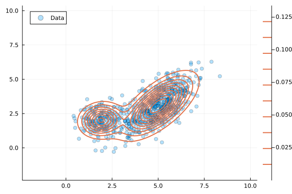
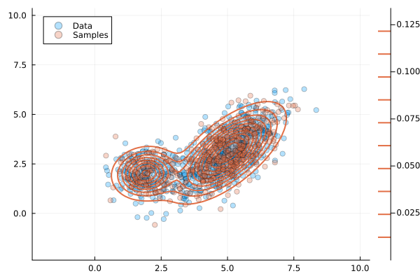

# Gaussian Mixture Model Example {#Gaussian-Mixture-Model-Example}

In _UncertaintyQuantification.jl_, we can construct a GMM from available data using the EM algorithm, as described in [Gaussian Mixture Models](/manual/gaussianmixture#Gaussian-Mixture-Models).

In this example, we will fit a GMM to synthetic data generated from two bivariate Gaussian distributions. We first load the necessary packages to fit the GMM and visualize the results.

```julia
using DataFrames
using Plots
using UncertaintyQuantification
```


Then, we generate some data from two bivariate Gaussian distributions that we use to fit a GMM.

```julia
n1, n2 = 200, 500
N₁ = MvNormal([2.0, 2.0], [0.5 0.0; 0.0 0.5])
N₂ = MvNormal([5.0, 3.0], [1.0 0.8; 0.8 1.5])
X = permutedims([rand(N₁, n1) rand(N₂, n2)])
```


To store and process the data, we use a `DataFrame`:

```julia
df = DataFrame(X, [:x1, :x2])
```


Then, we fit a `GaussianMixtureModel` with two dimensions ($x_1$ and $x_2$) and $K=2$ components to the data stored in `df`:

```julia
gmm = GaussianMixtureModel(df, 2)
```


```ansi
JointDistribution{MultivariateDistribution, Symbol}(MixtureModel{FullNormal}(K = 2)
components[1] (prior = 0.7381): FullNormal(
dim: 2
μ: [5.002383925923296, 3.062270537913635]
Σ: [1.02443468193135 0.8101611711716212; 0.8101611711716212 1.393038498284204]
)

components[2] (prior = 0.2619): FullNormal(
dim: 2
μ: [1.921526442295417, 2.0211770377197418]
Σ: [0.3968729812265203 0.03578443846882137; 0.03578443846882137 0.43846649649685415]
)

, [:x1, :x2])
```


To visually validate the fit, we can plot the data and the fitted GMM. We create a grid of points to evaluate the GMM&#39;s PDF and plot the contours.

```julia
x_range = range(-2, 10, length=100)
y_range = range(-2, 10, length=100)

scatter(df.x1, df.x2, alpha=0.3, label="Data")
contour!(x_range, y_range, (x,y) -> pdf(gmm, [x, y]), levels=10, linewidth=2, c=2, label="GMM")
```





From the fitted GMM, we can also draw samples and compare them to the original data. We generate 500 samples from the GMM and plot them.

```julia
samples = sample(gmm, 500)
scatter!(samples.x1, samples.x2, alpha=0.3, c=2, label="Samples")
```





---


_This page was generated using [Literate.jl](https://github.com/fredrikekre/Literate.jl)._
