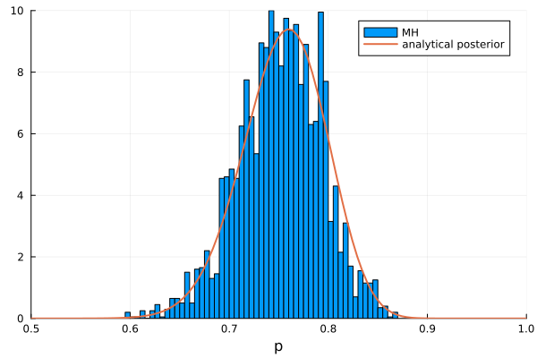
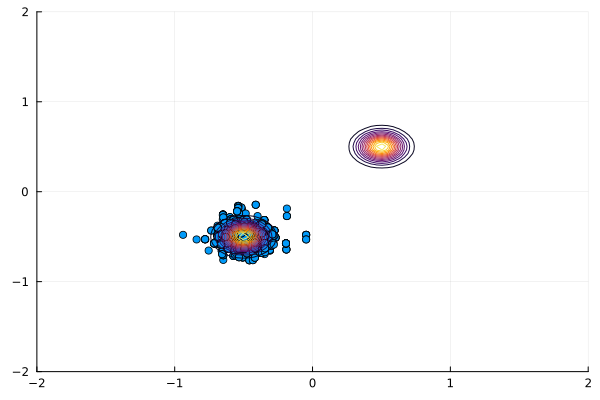
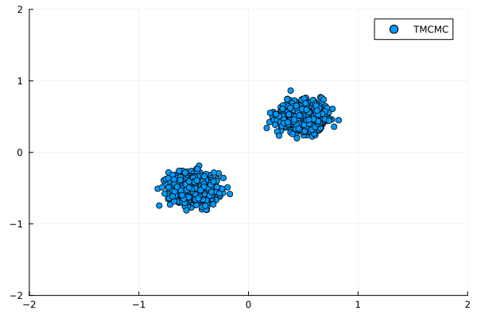

# Bayesian Updating {#Bayesian-Updating}

Bayesian updating is a method of statistical inference where Bayes&#39; theorem is used to update the probability distributions of model parameters based on prior beliefs and available data.

## Bayes&#39; Theorem {#Bayes'-Theorem}

Bayes&#39; theorem is defined as

$$P(\theta|Y) = \frac{P(Y|\theta)P(\theta)}{P(Y)},$$

where $P(\theta)$ is the prior distribution, describing prior belief on $\theta$. $P(Y|\theta)$ is the likelihood function evaluating how the data Y supports our belief. This is a function of $\theta$ not $Y$. $P(\theta|Y)$ is called the posterior distribution and expresses an updated belief under data $Y$. The term $P(Y)$, often called the marginal likelihood, or the evidence. It can be calculated as the integral of the likelihood multiplied by the prior distribution over the sample space of $\theta$

$$P(Y) = \int{}P(Y|\theta)P(\theta), d\theta{}.$$

This term serves as a normalizing constant for the posterior probability. However, as it can be difficult or even impractical to calculate it is often disregarded. Instead, only the product of likelihood and prior is used, as it is proportional to the posterior probability

$$P(\theta|Y) \propto P(Y|\theta)P(\theta).$$

Based on this relationship, the posterior probability can be approximated without calculation of $P(Y)$ using a variety of sampling methods. Classic approaches such as rejection sampling can be inefficient, especially for multivariate cases due to high rejection rates. Instead, Metropolis et al., proposed the use of Markov chains to increase efficiency [[27](/references#metropolisEquationStateCalculations1953)].

## Markov Chain Monte Carlo {#Markov-Chain-Monte-Carlo}

Markov chains are sequences of variables, where each variable is dependent on the last. In a discrete space $\Omega$ the series of random variables $\{X_1,X_2,\ldots,X_t\}$ is called a Marko chain if

$$p(X_t=x_t|X_{t-1}=x_{t-1},\ldots,X_1=x_1) = p(X_t=x_t|X_{t-1}=x_{t-1}) .$$

A Markov chain is called ergodic or irreducible when it is possible to reach each state from every other state with a positive probability. Markov chains that are ergodic and time-homogeneous, i.e. the probability between states doesn&#39;t depend on time, and have a unique stationary distribution such that

$$\pi(y) = \sum_{x\in\Omega}P(y|x)\pi(x).$$

The goal of Markov chain Monte Carlo (MCMC) sampling methods is to construct a Markov chain, whose stationary distribution is equal to the posterior distribution of Bayes&#39; theorem. This will result in samples generated from the Markov chain being equivalent to random samples of the desired distribution. The very first MCMC algorithm is the Metropolis-Hastings (MH) Algorithm.

### Metropolis Hastings {#Metropolis-Hastings}

The Metropolis-Hastings algorithm, was published in 1970 by W. K. Hastings [[28](/references#hastingsMonteCarloSampling1970)]. The MH algorithm is a random-walk algorithm that provides a selection criteria for choosing the next sample $(\theta_{i + 1})$ in a Markov chain. This is done through a so-called proposal distribution $q(\theta_{i + 1}|\theta_i)$ which is well known and relatively easy to sample from. Usually, symmetric proposal distributions centred at $(\theta_i)$ are used, for example Normal and Uniform distributions. A candidate sample $\theta^*$ is sampled from the proposal distribution and accepted with probability $\alpha$

$$\alpha = \min\left[1,\frac{P(\theta^*|Y)}{P(\theta_i|Y)}\cdot{}\frac{q(\theta_i|\theta^*)}{q(\theta^*|\theta_i)}\right].$$

Substituting the posterior with Bayes&#39; theorem yields

$$\alpha = \min\left[1,\frac{P(Y|\theta^*)\cdot{}P(\theta^*)/P(Y)}{P(Y|\theta_i)\cdot{}P(\theta_i)/P(Y)}\cdot{}\frac{q(\theta_i|\theta^*)}{q(\theta^*|\theta_i)}\right].$$

Note, how the normalization constant $P(Y)$ cancels out. When the proposal is symmetric $q(\theta_i|\theta^*) = q(\theta^*|\theta_i)$ the acceptance probability further simplifies to

$$\alpha = \min\left[1,\frac{P(\theta^*|Y)}{P(\theta_i|Y)}\right].$$

In practice, a random number $r \sim U(0,1)$ is sampled, and the candidate sample is accepted if $a \leq r$

$$\theta_{i + 1} = \theta^*     \qquad  \text{if} \quad a \leq r,\\
\theta_{i + 1} = \theta_{i}   \qquad  \text{otherwise.} \\$$

As an example consider a synthetic data sequence `Y` as the outcome of 100 Bernoulli trials with unknown success probability `p` (here p=0.8).

```julia
 n = 100
 Y = rand(n) .<= 0.8
```


The likelihood function which, similar to a `Model` must accept a `DataFrame`, follows a Binomial distribution and returns the likelihood for each row in the `DataFrame` as a vector. The prior is chosen as a beta distribution with $\alpha=\beta=1$ (uniform on $[0, 1]$). It is often beneficial to use the log-likelihood and log-prior for numerical reasons.

```julia
    function loglikelihood(df)
            return [
                sum(logpdf.(Binomial.(n, df_i.p), sum(Y))) for df_i in eachrow(df)
            ]
        end

logprior = df -> logpdf.(Beta(1,1), df.p)
```


**UncertaintyQuantification.jl** implements a variant of the MH algorithm known as single-component Metropolis-Hastings, where the proposal and acceptance step is performed independently for each dimension. To run the algorithm, we must first define the `SingleComponentMetropolisHastings` object which requires the `UnivariateDistribution` as a `proposal`, a `NamedTuple` for `x0` which defines the starting point of the Markov chain, the number of samples and the number of burn-in samples. The burn-in samples are used to start the chain but later discarded.

```julia
    proposal = Normal(0, 0.2)
    x0 = (;p=0.5)
    n_samples= 4000
    burnin = 500

    mh = SingleComponentMetropolisHastings(proposal, x0, n_samples, burnin)
```


```ansi
SingleComponentMetropolisHastings(Normal{Float64}(μ=0.0, σ=0.2), (p = 0.5,), 4000, 500, true)
```


The final optional argument `islog=true` can be omitted when passing the log-likelihood and log-prior. When set to `false`, the algorithm will `log` for both the likelihood and prior. Finally, the algorithm is executed using the `bayesianupdating` function. This function returns the samples and the average acceptance rate.

```julia
mh_samples, α   = bayesianupdating(logprior, loglikelihood, mh)
```


The following figure shows a histogram of the samples returned by the Metropolis-Hastings algorithm. For comparison, we also plot the analytical posterior distribution obtained using [conjugate priors](https://en.wikipedia.org/wiki/Conjugate_prior) [[29](/references#raiffaAppliedStatisticalDecision1961)].





As a second example we will attempt to sample from a bimodal target distribution in two dimensions. The prior is uniform over $[-2, 2]$ in each dimension and the likelihood is a mixture of two Gaussian functions centred at $[0.5, 0.5]$ and $[-0.5, -0.5]$.  The standard deviation for both Gaussians are identical and if small enough will effectively disconnect the two functions.

```julia
prior = Uniform(-2, 2)
logprior = df -> logpdf.(prior, df.x) .+ logpdf.(prior, df.y)

N1 = MvNormal([-0.5, -0.5], 0.1)

N2 = MvNormal([0.5, 0.5], 0.1)

loglikelihood =
    df -> log.([0.5 * pdf(N1, collect(x)) + 0.5 * pdf(N2, collect(x)) for x in eachrow(df)])

n = 2000
burnin = 500

x0 = (; x=0.0, y=0.0)

proposal = Normal()

mh = SingleComponentMetropolisHastings(proposal, x0, n, burnin)

mh_samples, α = bayesianupdating(logprior, loglikelihood, mh)
```





The scatter plot clearly shows that the MH algorithm has converged to only one of the two peaks of the bimodal target (contour also plotted). In fact, this is a known weakness of the MH algorithm. However, there are a number of alternative MCMC methods that aim to solve this problem. One of these methods, known as Transitional Markov Chain Monte Carlo [[30](/references#chingTransitionalMarkovChain2007)], will be presented next.

### Transitional Markov Chain Monte Carlo {#Transitional-Markov-Chain-Monte-Carlo}

The Transitional Markov Chain Monte Carlo (TMCMC) method [[30](/references#chingTransitionalMarkovChain2007)] is an extension of the MH algorithm where instead of directly sampling a complex posterior distribution, samples are obtained from a series of simpler **transitional** distributions. The samples are obtained from independent single-step Markov Chains. The transitional distributions are defined as

$$    P^j \propto P(Y|\theta)^{\beta_j} \cdot P(\theta),$$

where $j \in \{1, \ldots, m \}$ is the number of the transition step and $\beta_j$ is a tempering parameter with $\beta_1 < \cdots, \beta_m =1$. This enables a slow transition from the prior to the posterior distribution. An important part of the TMCMC algorithm is that the tempering parameter has to be selected as to ensure the transition is smooth and gradual. The algorithm&#39;s authors suggest choosing the parameter such that a coefficient of variation of 100% is maintained in the likelihood $P(Y\theta_i)^{\beta_j-\beta_{j - 1}}$. At each level $j$ the starting points for the independent Markov Chains are randomly samples (with replacement) from the current set of samples using statistical weights

$$w(\theta_i) = \frac{P(Y|\theta_i)^{\beta_j-\beta_{j-1}}}{\sum_{i=1}^N P(Y|\theta_i)^{\beta_j-\beta_{j-1}}}.$$

The complete TMCMC algorithm can be summarized as
1. Set $j=0$ and $\beta_j=0$. Sample $\theta_i \sim P(\theta)$.
  
2. Set $j = j+1$.
  
3. Compute the next tempering parameter $\beta_j$.
  
4. Determine the weights $w(\theta_i)$.
  
5. Generate a single-step Markov chain for each $\theta_i$.
  
6. Repeat steps (2) to (5) until (and including) $(\beta_j=1)$.
  

Returning to the bimodal example, this time using the TMCMC algorithm. In order to apply a different MCMC algorithm we only need to construct a `TransitionalMarkovChainMonteCarlo` object and pass it to the `bayesianupdating` method. The definition of prior and likelihood remains the same. In difference to the `SingleComponentMetropolisHastings` the log evidence is returned instead of the acceptance rate.

```julia
tmcmc = TransitionalMarkovChainMonteCarlo(RandomVariable.(Uniform(-2,2), [:x, :y]), n, burnin)

tmcmc_samples, S = bayesianupdating(logprior, loglikelihood, tmcmc)
```





The resulting scatter plot shows how TMCMC is able to sample both peaks of the bimodal target distribution. The standard implementation of TMCMC uses a multivariate Gaussian proposal distribution centred at each $\theta_i$ with covariance matrix $\Sigma$ estimated from the current likelihood scaled by a factor $\beta^2$. This scaling factor defaults to $0.2$ as suggested by the authors, but can optionally be passed to the constructor as a fourth argument. Application of different MCMC Algorithms nested in the TMCMC give rise to variants of the algorithm. For example, it is possible to use the previously introduced `SingleComponentMetropolisHastings` resulting in `SingleComponentTransitionalMarkovChainMonteCarlo`.

::: tip Note

`SingleComponentTransitionalMarkovChainMonteCarlo` is currently not available but planned for implementation.

:::

For convenience, the prior can be automatically constructed from the random variables passed to `TransitionalMarkovChainMonteCarlo`.

```julia
tmcmc = TransitionalMarkovChainMonteCarlo(RandomVariable.(Uniform(-2,2), [:x, :y]), n, burnin)

tmcmc_samples, S = bayesianupdating(loglikelihood, tmcmc)
```


## Maximum likelihood and maximum a posteriori estimates {#Maximum-likelihood-and-maximum-a-posteriori-estimates}

Instead of using sample-based methods it is also possible to calculate the local maxima of likelihood ($P(Y|\theta)$) or posterior ($P(\theta|Y)$). While this does not directly give an esimate of the full parameter distribution, it allows for the estimation of the most probable parameter values. Calculating the maximum (or maxima, depending on the use case) is referred to as maximum likelihood estimate (MLE), using the full (unnormalized) posterior is referred to as maximum a posteriori (MAP) estimate. Note that technically MLE is not a Bayesian estimate as the prior distribution is ignored. More formally,

$$\theta_{\text{MLE}} = \underset{\theta}{\arg \max} P(Y|\theta)$$

$$\theta_{\text{MAP}} = \underset{\theta}{\arg \max} P(Y|\theta) P(\theta)$$

Generally, the MAP estimate can be considered as regularized version of the MLE, since the prior distribution is used to constrain the estimates. Both estimates are found with optimization schemes and thus come with the usual drawbacks, including convergence to local maxima. Both methods are therefore sensitive to initial conditions. Further note that both estimates do not calculate the mean but the mode of the respective distributions, i.e. for distributions that have a high variance these estimates do not provide much information about the parmater distribution.

The implementation in **UncertaintyQuantification.jl** is analgous to the sampling methods. A `MaximumAPosterioriBayesian` or a `MaximumLikelihoodBayesian` object is created that takes the important settings as input. These are the prior, the optimization method to use and the starting points for optimization. For convenience, multiple points can be specified here. The optimization method is given as a string such that the `Optim.jl` package does not need to be included in the script. Finally, the `bayesianupdate`-function can be used again with the known syntax, i.e. a likelihood, `UQ-Model`-array and the desired object for the method are given and a `DataFrame` is returned. The log-densities are given in the `DataFrame` as the variable `:maxval`. Below is an example for the implementation.

```julia
μ = 0
σ = .2

prior = RandomVariable.(Normal(μ,σ), [:x, :y])

N1 = MvNormal([-0.5, -0.5], 0.1)
N2 = MvNormal([0.5, 0.5], 0.1)

loglikelihood =
    df -> log.([0.5 * pdf(N1, collect(x)) + 0.5 * pdf(N2, collect(x)) for x in eachrow(df)])

priorFunction =
    df -> prod.([pdf(Normal(μ, σ), collect(x)) for x in eachrow(df)])

x0 = [[.1, .1],[-.1,-.1]]

MAP = MaximumAPosterioriBayesian(prior, "LBFGS", x0)
MLE = MaximumLikelihoodBayesian(prior, "LBFGS", x0)

mapestimate = bayesianupdating(loglikelihood, UQModel[], MAP)
mlestimate = bayesianupdating(loglikelihood, UQModel[], MLE)

contour!(xs, ys, likelihood_eval.*prior_eval/.05, lim = [-2,2], c = :black)
scatter!(mapestimate.x, mapestimate.y; lim=[-2, 2], label = "MAP estimate", c = :black)
scatter!(mlestimate.x, mlestimate.y; lim=[-2,2], label = "ML estimate", c = :red)
plot!([0,0],[0,0],c = :red, label = "Likelihood")
plot!([0,0],[0,0],c = :blue, label = "Prior")
plot!([0,0],[0,0],c = :black, label = "Posterior")
```


```ansi
┌ Warning: Multiple series with different color share a colorbar.
│ Colorbar may not reflect all series correctly.
└ @ Plots ~/.julia/packages/Plots/8ZnR3/src/backends/gr.jl:530
┌ Warning: Multiple series with different line color share a colorbar.
│ Colorbar may not reflect all series correctly.
└ @ Plots ~/.julia/packages/Plots/8ZnR3/src/backends/gr.jl:530
```


The figure shows the (bimodal) likelihood in red and the prior distribution in blue. The difference in MAP and MLE is clearly visible, as the MLE conincides directly with the maxima of the likelihood, while MAP is shifted in the direction of the prior mean.


## Bayesian calibration of computer simulations {#Bayesian-calibration-of-computer-simulations}

_UncertaintyQuantification.jl_ allows for complex computer models to be included in the Bayesian updating procedure, if for example one wishes to infer unknown model parameters from experimental data of model outputs. Several models can be evaluated in order to compute the likelihood function, by passing a vector of [`UQModel`](/api/models#UncertaintyQuantification.UQModel)s to the [`bayesianupdating`](/api/bayesianupdating#UncertaintyQuantification.bayesianupdating) method. These will be executed before the likelihood is evaluated and models outputs will be available in the `DataFrame` inside the likelihood function. There is no restriction on the type of [`UQModel`](/api/models#UncertaintyQuantification.UQModel) used. For example, it is possible to use an `ExternalModel` and call an external solver.

For a complete example refer to the [Inverse eigenvalue problem](/examples/bayesianupdating#Inverse-eigenvalue-problem).
