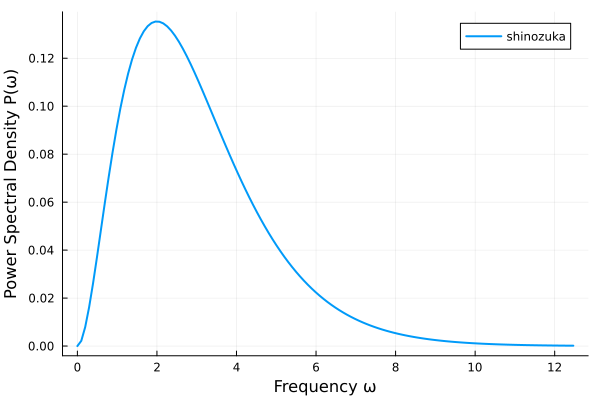
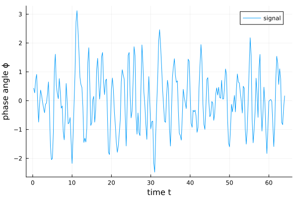

# Stochastic Dynamics {#Stochastic-Dynamics}

Stochastic dynamics focuses on the study and development of methods, applications, and techniques for analyzing systems with probabilistic behavior. Stochastic dynamic systems are mathematical models used to describe the mechanical behavior and evolution of systems that change over time and include probabilistic characteristics. These systems are characterized by their dynamics&#39; uncertainty, variability, and randomness, which can arise from external influences, inherent randomness, or imperfect knowledge of system parameters. Such systems are crucial in fields ranging from finance and economics to engineering and natural sciences, as they allow for modeling and predicting the behavior of complex systems under uncertainty.

Some examples that shall introduce stochastic dynamics in UQ.jl study the behaviour of buildings and systems and their changes over time when they are affected by random processes, or also called stochastic processes, such as earthquakes or wind loads. Stochastic processes are characterised by an inherent randomness which can not be described deterministically [[31](/references#li2009sdos)]. To study the frequency distribution and their amplitude of a stochastic process, the so-called power spectral density (PSD) function can be defined.

## Semi-empirical PSD functions {#Semi-empirical-PSD-functions}

Semi-empirical PSD functions describe the distribution of power across frequencies, combining theoretical models with experimental data for improved accuracy. Well established models in earthquake engineering are, for instance, the Kanai-Tajimi PSD model [[32](/references#kanai1957semi), [33](/references#tajimi1960statistical)] or the Clough-Penzien PSD model [[34](/references#clough1975structures)]. 

The Clough-Penzien PSD model $S^{CP}$ with frequency vector $\omega$ reads as follows

$$    S^{CP}(\omega, S_0, \omega_{f}, \zeta_{f}, \omega_{g}, \zeta_{g}) = S_0 \cdot \frac{{\omega^4}}{{(\omega_{f}^2-\omega^2)^2+4  \zeta_{f}^2  \omega_{f}^2  \omega^2}} \cdot \frac{{\omega_{g}^4+4  \zeta_{g}^2  \omega_{g}^2  \omega^2}}{{(\omega_{g}^2-\omega^2)^2+4  \zeta_{g}^2  \omega_{g}^2  \omega^2}},$$

where the parameters $S_0$, $\omega_{f}$, $\zeta_{f}$, $\omega_{g}$ and $\zeta_{g}$ characterize the soil conditions.

The Shinozuka Deodatis Function is another PSD function and is characterized as:

$$    S(\omega) = \frac{1}{4} \sigma^2 b^3 \omega^2 e^{-b \left| \omega \right|}$$

This function depends on the vector $\omega$, which is uniformly distributed from 0 to the cut-off frequency $\omega_u$ in intervals $delta \omega = \omega_u/N$. Here is N the number of needed terms.

## Stochastic Process Generation {#Stochastic-Process-Generation}

The spectral representation method (SRM) [[35](/references#shinozuka1991simulation)] can be utilised to generate realisations of stochastic processes $x(t)$ which are carrying the characteristics of a PSD function $S(\omega)$ in time domain. The stochastic character of these processes is represented by random phase angles $\varphi$. The spectral representation method reads as follows

$$    x(t) = \sqrt{2} \sum \limits_{n=0}^{N_{\omega}-1}\sqrt{2 S(\omega_n) \Delta \omega} \cos(\omega_n t + \varphi_n),$$

where $\Delta \omega$ is the frequency increment, $\omega_n$ is the frequency at coordinate $n$, $t$ is the time vector and $N_{\omega}$ is the total number of frequency points.

Stochastic processes generated by SRM can be utilised in a Monte Carlo framework, for instance, in order to determine the structural reliability or other quantities of interest.

## PSD estimation {#PSD-estimation}

If a time signal, such as an earthquake, is given in time domain and shall be studied for their characteristics in frequency domain, the PSD estimation can be carried out. Although rigorous mathematical relationships between stochastic processes and the PSD function exist, estimation techniques are often necessary since an exact determination would require continuous signals of infinite length, which are not practical in real-world applications.

A frequently used estimator of the stationary PSD function from time records is the periodogram [[31](/references#li2009sdos)]. To transform a stationary stochastic process from time domain to frequency domain, the discrete Fourier transform (DFT) can be utilised. The periodogram is the squared absolute value of the DFT of the discrete time signal $x$ with data point index $n$, such as

$$    \hat{S}_X(\omega_k) = \frac{\Delta t^2}{T} \left| \sum \limits_{n = 0}^{N_t-1} x_n e^{-2 \pi i k n / N_t} \right|^2,$$

where $\Delta t$ is the time discretisation, $T$ is duration of the record, $N_t$ is the total number of data points, $i$ is the imaginary unit and $k$ is the integer frequency for $\omega_k = \frac{2 \pi k}{T}$.

## Nyquist Frequency {#Nyquist-Frequency}

In the context of discretising continuous signals, the Nyquist frequency $f_Ny$ is an essential concept. It is defined as half of the sampling frequency $f_s$, i.e.

$$    f_Ny = \frac{f_s}{2}.$$

Frequencies higher than $f_Ny$ cannot be uniquely represented in the sampled signal. Instead, they appear as lower frequencies within the interval $[0, f_Ny]$, a distortion known as _aliasing_. To avoid this effect, the sampling rate must be chosen such that the maximum frequency of the signal does not exceed the Nyquist frequency:

$$    f_max < f_Ny$$

If the chosen parameters do not satisfy this condition, the code does not stop the computation, but issues a warning to indicate the potential occurrence of aliasing.

## Implementation {#Implementation}

To follow the procedure of generating signals that approximate homogeneous gaussian processes, as presented in [[35](/references#shinozuka1991simulation)], first we need to define parameters for the frequency domain of the PSD function.

```julia
N = 128                         # Number of terms
ω_u = 4π                        # Cut-off frequency
Δω = ω_u / N                    # Frequency discretisation size
ω = collect(0:Δω:(ω_u - Δω))    # Frequency discretisation vector
```


With the discretized frequency domain in $\omega$, let us create a PSD function simply by calling

```julia
sd = ShinozukaDeodatis(ω, 1, 1) # σ=1 b=1
```


```ansi
ShinozukaDeodatis([0.0, 0.09817477042468103, 0.19634954084936207, 0.2945243112740431, 0.39269908169872414, 0.4908738521234052, 0.5890486225480862, 0.6872233929727672, 0.7853981633974483, 0.8835729338221293  …  11.584622910112362, 11.682797680537043, 11.780972450961723, 11.879147221386406, 11.977321991811086, 12.075496762235767, 12.173671532660448, 12.271846303085129, 12.370021073509811, 12.468195843934492], 1, 1, [0.0, 0.002184253480257515, 0.007920019787398558, 0.01615370039459961, 0.026032311709710227, 0.03687194105234497, 0.0481306505561695, 0.0593852446591769, 0.0703113898816206, 0.08066663983075278  …  0.00031229570199260145, 0.0002879115942576991, 0.00026539391594671387, 0.00024460337782646903, 0.0002254107425931193, 0.00020769613278054383, 0.00019134838302693383, 0.00017626443419187804, 0.0001623487669220179, 0.00014951287236894594])
```


here $\sigma=1$ defines the first parameter of the provided analytical PSD in [[35](/references#shinozuka1991simulation)] and $b=1$ the second parameter. There are other PSD functions predefined, such as

```julia
cp = CloughPenzien(ω, 0.1, 0.8π, 0.6, 8π, 0.6)  # S_0=0.1, ω_f=0.8π, ζ_f=0.6, ω_g=8π, ζ_g=0.6
kt = KanaiTajimi(ω, 0.25, 5, 0.75)              # S_0=.25, ω_0=5, ζ=0.75
```


```ansi
KanaiTajimi([0.0, 0.09817477042468103, 0.19634954084936207, 0.2945243112740431, 0.39269908169872414, 0.4908738521234052, 0.5890486225480862, 0.6872233929727672, 0.7853981633974483, 0.8835729338221293  …  11.584622910112362, 11.682797680537043, 11.780972450961723, 11.879147221386406, 11.977321991811086, 12.075496762235767, 12.173671532660448, 12.271846303085129, 12.370021073509811, 12.468195843934492], 0.25, 5, 0.75, [0.25, 0.2501927099497609, 0.25077016954978437, 0.25173035972488217, 0.2530698878054118, 0.25478394696301443, 0.25686626093999926, 0.2593090156248634, 0.26210277951320693, 0.26523641560517924  …  0.10493221910977876, 0.10322840434412243, 0.10156370449415349, 0.09993703243995293, 0.0983473327418927, 0.09679358094694115, 0.09527478287513262, 0.09378997389167106, 0.09233821816944897, 0.09091860794614824])
```


`CloughPenzien` and `KanaiTajimi` are semi-empirical PSD functions used to model ground motion for earthquake engineering applications, for reference see [[32](/references#kanai1957semi)], [[33](/references#tajimi1960statistical)] and [[34](/references#clough1975structures)].

To go obtain the distribution of power over the frequencies call the `evaluate` function of the `PSD` object, which was introduced as the periodogram. To illustrate, we plot the created `ShinozukaDeodatis` power spectral density.

```julia
p = evaluate(sd)
plot(sd.ω, p; label="shinozuka", xlabel = "Frequency ω", ylabel = "Power Spectral Density P(ω)", linewidth = 2)
```





To the generation of signals in the time domain, we need to define the time domain.

```julia
T0 = 2π/Δω              # Total simulation time
Δt = 2π/(2*ω_u)         # Time step size
t = collect(Δt:Δt:(T0)) # Time discretisation vector
```


With the time domain `t` and the PSD function `sd`, we can generate a `SpectralRepresentation` object

```julia
srm_obj = SpectralRepresentation(sd, t, :ShnzkSR)
```


```ansi
SpectralRepresentation(ShinozukaDeodatis([0.0, 0.09817477042468103, 0.19634954084936207, 0.2945243112740431, 0.39269908169872414, 0.4908738521234052, 0.5890486225480862, 0.6872233929727672, 0.7853981633974483, 0.8835729338221293  …  11.584622910112362, 11.682797680537043, 11.780972450961723, 11.879147221386406, 11.977321991811086, 12.075496762235767, 12.173671532660448, 12.271846303085129, 12.370021073509811, 12.468195843934492], 1, 1, [0.0, 0.002184253480257515, 0.007920019787398558, 0.01615370039459961, 0.026032311709710227, 0.03687194105234497, 0.0481306505561695, 0.0593852446591769, 0.0703113898816206, 0.08066663983075278  …  0.00031229570199260145, 0.0002879115942576991, 0.00026539391594671387, 0.00024460337782646903, 0.0002254107425931193, 0.00020769613278054383, 0.00019134838302693383, 0.00017626443419187804, 0.0001623487669220179, 0.00014951287236894594]), [0.25, 0.5, 0.75, 1.0, 1.25, 1.5, 1.75, 2.0, 2.25, 2.5  …  61.75, 62.0, 62.25, 62.5, 62.75, 63.0, 63.25, 63.5, 63.75, 64.0], [0.0 0.0 … 0.0 0.0; 0.02454369260617026 0.04908738521234052 … 6.258641614573416 6.283185307179586; … ; 3.0925052683774528 6.1850105367549055 … 788.5888434362505 791.6813487046279; 3.117048960983623 6.234097921967246 … 794.8474850508238 797.9645340118075], 0.09817477042468103, [0.0, 0.02070934977123097, 0.03943465796445519, 0.05631848413707344, 0.0714942826486781, 0.08508694785836825, 0.09721332798276672, 0.10798270936615924, 0.11749727281829432, 0.12585252358466703  …  0.007830652443792696, 0.007518730566904699, 0.007218723816600235, 0.006930206412974308, 0.006652766027050156, 0.006386003469122759, 0.006129532376095776, 0.005882978898623371, 0.005645981388793122, 0.005418190089016056], :ShnzkSR, [:ShnzkSR_ϕ_1, :ShnzkSR_ϕ_2, :ShnzkSR_ϕ_3, :ShnzkSR_ϕ_4, :ShnzkSR_ϕ_5, :ShnzkSR_ϕ_6, :ShnzkSR_ϕ_7, :ShnzkSR_ϕ_8, :ShnzkSR_ϕ_9, :ShnzkSR_ϕ_10  …  :ShnzkSR_ϕ_119, :ShnzkSR_ϕ_120, :ShnzkSR_ϕ_121, :ShnzkSR_ϕ_122, :ShnzkSR_ϕ_123, :ShnzkSR_ϕ_124, :ShnzkSR_ϕ_125, :ShnzkSR_ϕ_126, :ShnzkSR_ϕ_127, :ShnzkSR_ϕ_128])
```


To sample random phase angles, call

```julia
ϕ = sample(srm_obj)
```


$\varphi$ is a `DataFrame`, with each row containing one random sample for the `N` phase angles. To draw multiple samples at once, pass the number of samples as a second argument to the `sample` function.

Finally, to retrieve the signal corresponding to the phase angles  pass them to the `evaluate` method. The `ϕnames` property of the `SpectralRepresentation` helps to conveniently select only the phase angles from the `DataFrame` in case additional variables are present.

```julia
x = evaluate(srm_obj, collect(ϕ[1, :]))
plot(srm_obj.time, x; label="signal", xlabel = "time t", ylabel = "phase angle ϕ")
```




