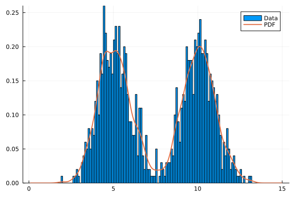

# Kernel Density Estimation {#Kernel-Density-Estimation}

Kernel density estimation (KDE) is a non-parametric method to estimate the probability density function of a random variable through _kernel smoothing_ [[9](/references#silvermanDensityEstimationStatistics1986)].

The kernel density estimate $\hat{f}_h$ of a univariate density `f` based on a random sample $X_1,\ldots,X_n$ is defined as

$$\hat{f}_h(x) = n^{-1} \sum_{i=1}^n h^{-1} K \left\{\frac{x-X_i}{h}\right\},$$

where $h$ is the so called _bandwidth_ and $K$ is the kernel function. The kernel function is assumed to be a symmetric probability density and is set to be a Gaussian density in _UncertaintyQuantification.jl_. The bandwidth $h$ also called the _smoothing parameter_ has a strong effect on the resulting density estimate. There are various different methods to select an optimal bandwidth. Here we have decided to apply the method developed by Sheather &amp; Jones [[10](/references#sheatherReliableDataBasedBandwidth1991)] for its excellent performance and straightforward implementation.

The kernel density estimation is exposed through the [`EmpiricalDistribution`](/api/inputs#UncertaintyQuantification.EmpiricalDistribution). Since the bandwidth is automatically selected only a vector containing the data must be passed to the constructor.

```julia
 d = EmpiricalDistribution(x)
```


Internally, we perform the kernel density estimation to obtain the _PDF_ of the distribution. From this PDF we estimate the support of the distribution through numerical root finding. The _CDF_ and the quantile function (inverse CDF) are interpolated from the numerical integral of the PDF. The number of points used for this interpolation (defaults to $10^4$) can be passed to the constructor as an optional second parameter. As a `ContinousUnivariateDistribution` the [`EmpiricalDistribution`](/api/inputs#UncertaintyQuantification.EmpiricalDistribution) can be applied the same as any of the native distributions from _Distributions.jl_.

## Example {#Example}

As an example we consider synthetic data generated from a bimodal distribution and fit the empirical distribution.

```julia
x = [rand(Normal(5), 500)..., rand(Normal(10), 500)...]
ed = EmpiricalDistribution(x)
```


Next, we plot the normalized histogram of the data and the resulting PDF.





::: tip Multivariate Density Estimation with Gaussian Mixture Models

Multivariate density estimation can be performed using Gaussian mixture models. For more information see [Gaussian Mixture Models](/manual/gaussianmixture#Gaussian-Mixture-Models).

:::
