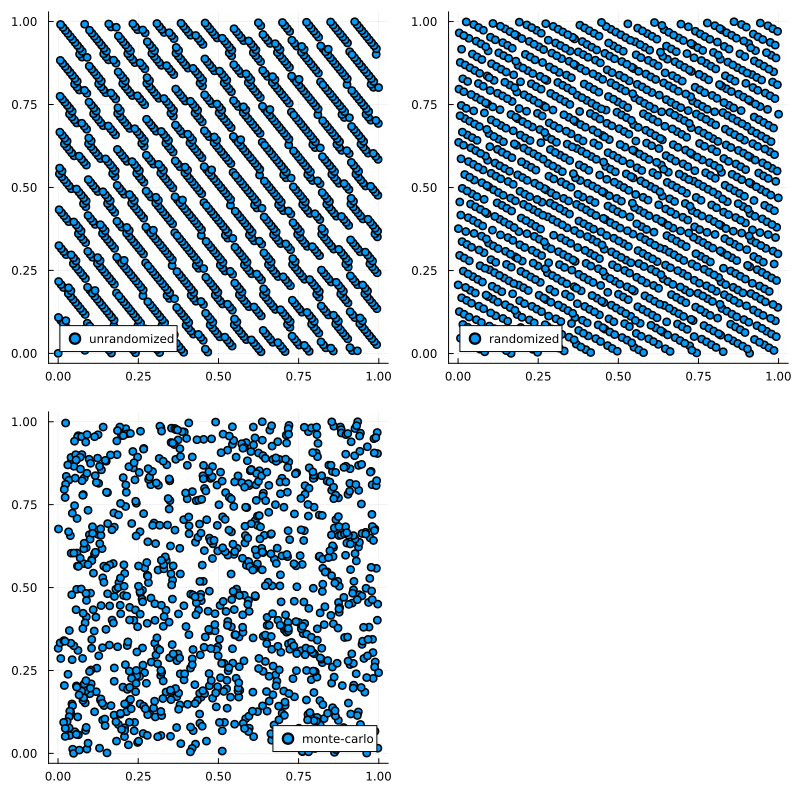

# Simulations {#Simulations}

## Monte Carlo {#Monte-Carlo}

The Monte-Carlo (MC) method is a method of sampling random numbers that dates back to 1777. The name was suggested by Nick Metropolis when MC was used while working on the Manhattan Project. It is used in Random Number Generators which generally produce pseudo random numbers.

## Quasi Monte Carlo {#Quasi-Monte-Carlo}

Quasi Monte Carlo (QMC), is a method of producing samples similar to those generated via Monte Carlo (MC). The difference being that QMC samples are generated deterministically in a way to ensure they are evenly distributed across the sampling space, not forming clutters or voids as MC samples might. This makes QMC more efficient than MC for lots of applications since fewer samples are needed in order to produce a sufficient density of samples throughout. There are multiple ways of QMC-sampling which can be classified as either digital nets or lattices. [[25](/references#owenQuasiMonteCarlo2009)]

Included here are `LatticeRuleSampling` and the digital nets `SobolSampling`, `HaltonSampling`, `FaureSampling` and `LatinHaypercubeSampling`.

However, being deterministic, these QMC samples are missing the properties related to randomness that MC samples have. To gain these properties it is possible to randomize QMC samples. There are several randomization methods, useful in different cases, depending on the QMC method in use. [[25](/references#owenQuasiMonteCarlo2009)]

Implemented in this package are Owen-Scramble and Matousek-Scramble, two similar methods useful for Sobol and Faure Sampling aswell as Shift which can be used for Lattice Rule Sampling. There also is an algorithm for Halton Sampling, that constructs builds samples from the ground up as opposed to randomizing existing samples which is what the aforementioned methods do. [[26](/references#owenRandomizedHalton2017)]

To sample using one of these methods, simply create an instance of the corresponding struct with the desired parameters and then call the sample function with this instance. The parameters are `n::Integer` which is the number of samples, and `randomization::Symbol` which encodes the randomization method that should be used. The different possible symbols are: `:none`, `:matousek`, `:owen`, `:shift` and `:randomizedhalton`.

```julia
    x = RandomVariable(Uniform(), :x)
    qmc = LatinHypercubeSampling(100)
    samples = sample(x, qmc)
```


Note that not all randomization methods are possible to use for every QMC-method. Also, if no `randomization`-symbol is given, the default will be used. View the following table for details.

| QMC-method          | DEFAULT           | :matousek | :owen | :shift | :randomizedhalton | :none |
|:------------------- |:----------------- |:---------:|:-----:|:------:|:-----------------:|:-----:|
| LatticeRuleSampling | :shift            |     ❌     |   ❌   |   ✅    |         ❌         |   ✅   |
| SobolSampling       | :matousek         |     ✅     |   ✅   |   ❌    |         ❌         |   ✅   |
| FaureSampling       | :matousek         |     ✅     |   ✅   |   ❌    |         ❌         |   ✅   |
| HaltonSampling      | :randomizedhalton |     ❌     |   ❌   |   ❌    |         ✅         |   ✅   |


::: tip Note

`LatinHypercubeSampling` is already random and thus doesn&#39;t have the `randomization` parameter.

:::

It is of course possible to directly create the struct inside the `sample`-call, enabling a more efficient version of the example above which looks like this:

```julia
    x = RandomVariable(Uniform(), :x)
    samples = sample(x, LatinHypercubeSampling(100))
```


::: tip Note

When chosing `n`, bear in mind that for `SobolSampling` and `FaureSampling`, `n` must fit the base that is used for creating the respective sequence. For `SobolSampling` the base is always equal to 2 while for `FaureSampling`, it depends on the number of input-variables. If `n` is not a power of the base, it will automatically be increased to the next power.

:::

```julia
    x = RandomVariable(Uniform(), :x)
    samples = SobolSampling(100)
```


```ansi
SobolSampling(128, :matousek)
```


To emphasize the importance of randomization, look at the correlations that might occur using unrandomized qmc and how they are fixed by randomizing.

This is the 7th dimension plotted against the 8th in Faure Sampling, unrandomized vs. randomized via Owen Scramble:




